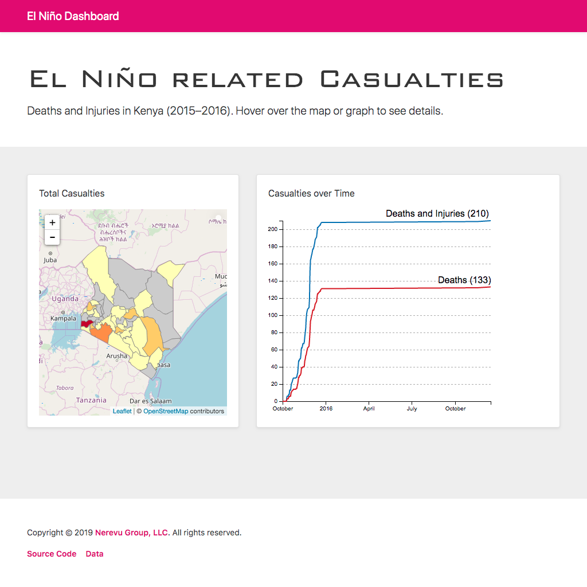

# Red Cross El Niño Dashboard



## Introduction

This [Brunch](//brunch.io) and [Mithril](//mithril.js.org) web application reveals El Niño’s impact on Kenya.

## Requirements

redcross-viz has been tested on the following configuration:

- MacOS X 10.13.6
- Brunch 3.0.0 (required)
- Mithril 1.1.7 (required)
- [npm](//www.npmjs.com/) 6.13.4 (required)
- [Coffeescript](//coffeescript.org/) 2.4.1 (required to run a production server)
- [Node.js](//nodejs.org) 10.14.2 (required to run a production server)


## Setup

*Install requirements (if you haven't already)*

```bash
npm install -g brunch coffeescript
```

## Installation

```bash
brunch new gh:nerevu/redcross-viz
cd nerevu/redcross-viz
npm install
```

## Usage

*Run development server (continuous rebuild mode)*

    npm start

*Run production node server*

    npm start:prod

*Build html/css/js files (will appear in `public/`)*

    npm build

*Build html and minified css/js files (will appear in `public/`)*

    npm build:prod

## License

redcross-viz is distributed under the [MIT License](//opensource.org/licenses/MIT).
